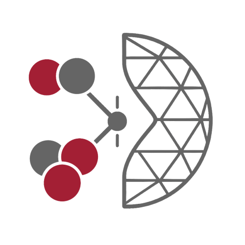

# Openmc Fusion Benchmarks

Welcome to the **OpenMC Fusion Benchmarks** project — a modular, code-agnostic, and automation-ready repository for defining, executing, and analyzing radiation transport benchmarks in fusion energy systems. Benchmarks are described through a rigorous, schema-driven YAML specification, and include detailed **CAD-based geometries** with automatic meshing support. The framework is designed for **easy integration and testing of new neutronics methods**, facilitating rapid development, comparison, and validation across codes, workflows, and datasets.


<!-- Shortcut cards -->
<div class="cards">

<div class="card">
  <a href="specifications/overview.html">
    
    <h3>Benchmark Specification</h3>
    <p>Learn about the schema-driven YAML format to define a benchmark.</p>
  </a>
</div>

<div class="card">
  <a href="benchmarks.html">
    
    <h3>Available Benchmarks</h3>
    <p>Explore the library of validated fusion neutronics benchmarks.</p>
  </a>
</div>

<div class="card">
  <a href="api.html">
    
    <h3>Python API</h3>
    <p>Use the OFB Python interface to load, validate, and run benchmarks.</p>
  </a>
</div>

</div>


## Sections
```{toctree}
:maxdepth: 1

intro
quickstart
specifications/index
benchmark_collection/index
```