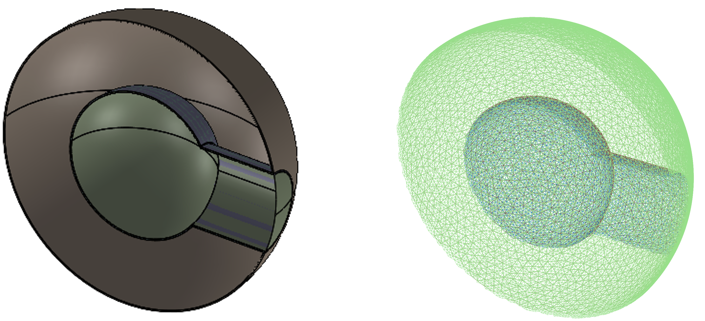
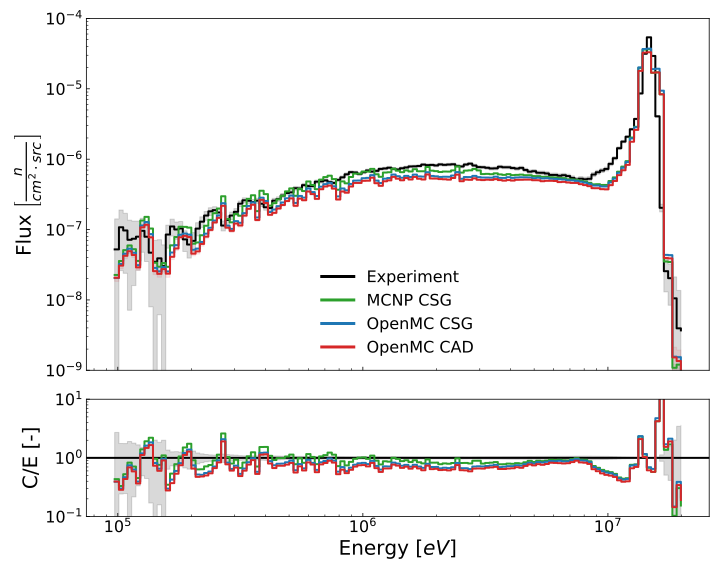
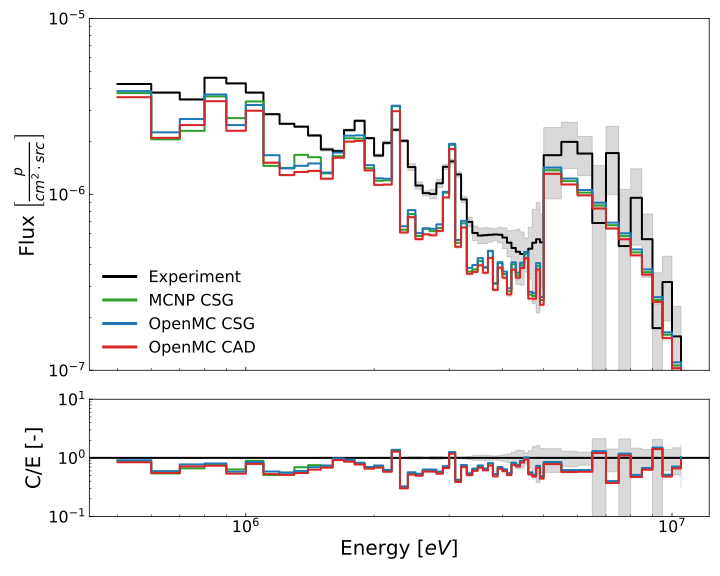
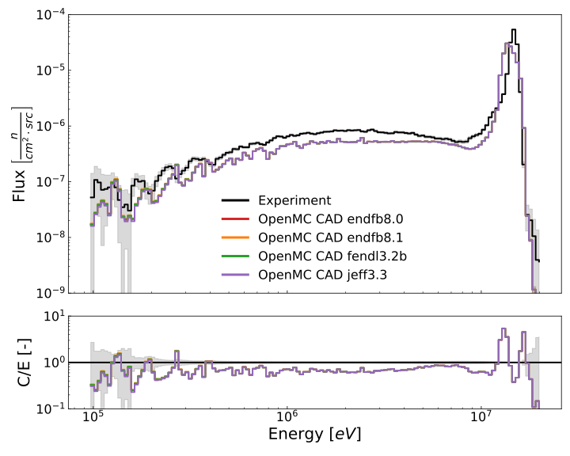
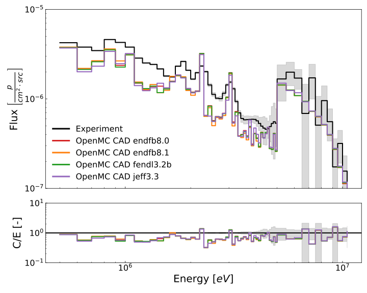
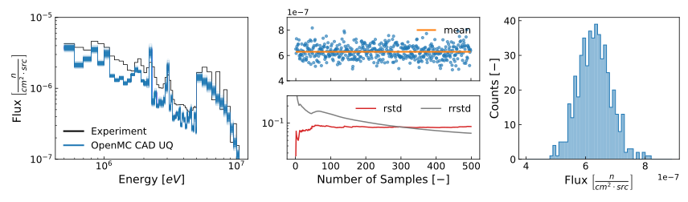

# Oktavian Aluminium

Here it is possible to find the analysis of Oktavian aluminum (`oktavian_al`) benchmark run with `OFB`.

## CAD

The following link opens an interactive 3D visualization of the CAD model and its relative mesh used in the benchmark:



## Results

Results are a set of energy spectra of neutron and photon leaking from the Oktavian aluminum sphere. Figures show energy spectra and C/E values are the ration between every computed value and the experimental value.

### CAD-CSG comparison
Comparison of Experimental, MCNP-CSG, OpenMC-CSG and OpenMC-CAD (from OFB) results for neutron and photon leakage spectra.






### Nuclear Data on CAD analysis
Comparison of ENDF\B-8.0, ENDF\B-8.1, FENDL-3.2b and JEFF-3.3 nuclear data libraries results run with OFB (OpenMC-CAD model) {cite}`brown2018endf80` {cite}`nobre2025endfb8.1` {cite}`schnabel2024fendl` {cite}`plompen2020jeff3.3`.





### Uncertainty Quantification analysis
Total Monte Carlo Uncertainty Quantification (TMC-UQ) results obtained performing 500 perturbations of Al27 cross sections in ENDF\B-8.0 and run the OpenMC CAD model. The center panels and right panels of the two figfures give an insight of statistics at the ~14 MeV energy group for neutrons and ~7.5 MeV energy group for photons.




## References

```{bibliography}