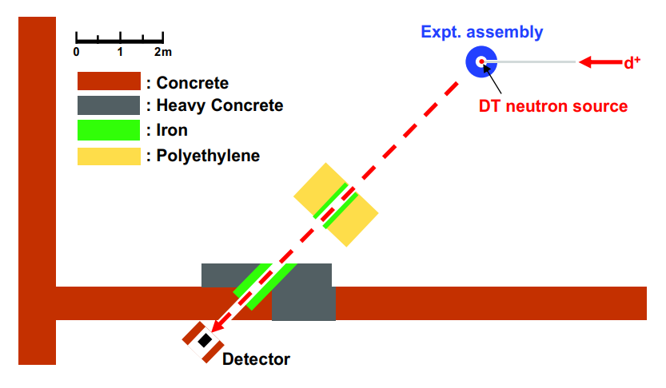

# Oktavian General Information

OKTAVIAN, located at Osaka University, has been operational since 1981 as a high-intensity deuterium-tritium (D-T) neutron source. The facility delivers 1.5-ns pulses producing up to 10³ D-T neutrons per pulse or operates continuously at a maximum yield of 3×10¹² D-T neutrons per second. Utilizing a high-current deuteron beam accelerator, OKTAVIAN has served as a reference facility for numerous fusion neutronics experiments, providing valuable data for the study of D-T fusion neutron transport phenomena.

Among the experimental campaigns conducted at OKTAVIAN, a series of integral sphere pile experiments were performed between 1984 and 1988. These experiments focused on the measurement of leakage neutron current spectra above 100 keV using the time-of-flight (TOF) technique, employing a flight path of approximately 11 meters. Neutrons were detected using a cylindrical liquid organic scintillator (NE-218) {cite}`konno2023jendl`.

The experimental setup employed hollow stainless-steel spherical vessels filled with powdered or flaked materials such as Al, Co, Cr, Cu, LiF, Mn, Mo, Si, Ti, W, and Zr. Three distinct vessel geometries were used across the experiments.

## Description of Source and Experimental Configuration



The experimental configuration is illustrated in the figure above {cite}`konno2023jendl`.

In these experiments, neutrons were generated by bombarding a 370 GBq tritium target with a 250 keV deuteron beam. The neutron source spectrum was characterized using the same detection system applied for the leakage neutron measurements {cite}`maekawa1994collection`. Although the spatial distribution of emitted neutrons was characterized, for analysis purposes an isotropic source distribution was typically assumed.

The neutron spectra were measured via the TOF technique. The tritium target was placed at the center of the experimental assembly, while neutrons were detected by the NE-218 liquid scintillator positioned approximately 11 meters away and at an angle of 55 degrees relative to the deuteron beam axis. A pre-collimator composed of polyethylene and iron multi-layers was installed between the experimental assembly and the detector to suppress background neutrons. The collimator aperture was sized to fully encompass the surface of the assembly facing the detector.

In addition to neutron measurements, gamma-rays were also characterized using a cylindrical NaI scintillation detector. Gamma-ray energy spectra were obtained by unfolding pulse-height spectra using the detector response matrix. The gamma-ray detector was positioned 5.8 meters from the neutron source and collected emissions during the experiments. TOF spectra for both neutrons and gamma-rays, along with pulse-height spectra, were recorded simultaneously.

## Neutron and Gamma-Ray Measurement Setup

The NE-218 scintillator (12.7 cm in diameter and 5.1 cm in length) was utilized for neutron detection. The efficiency of the detector was evaluated through a combination of:

1. Monte Carlo simulations,
2. experimental efficiency measurements based on TOF data of Cf-252 spontaneous fission and Watt spectrum,
3. efficiency measurements obtained from leakage spectra of a 30 cm diameter graphite sphere using a comparable detection configuration.

For absolute neutron spectrum monitoring, a cylindrical niobium foil was placed in front of the tritium target and irradiated during TOF measurements. The absolute neutron leakage spectrum was determined from the gamma activity of Nb-92m and the integrated neutron source counts. The detailed procedure is documented in the OKTAVIAN Report {cite}`kimura1998benchmark`.

For gamma-ray measurements, OKTAVIAN was operated in pulsed mode at 500 kHz repetition rate with a 3 ns pulse width (FWHM). The TOF separation between 14 MeV neutrons and prompt gamma-rays was approximately 90 ns, which allowed effective discrimination of gamma-rays from neutron background in the TOF spectra.

The recorded gamma-ray spectra were mainly dominated by emissions from (n,n') and (n,2n) reactions, rather than (n,xγ) processes. These data provide valuable input for evaluating nuclear data related to gamma-ray energy distributions resulting from non-elastic scattering of high-energy neutrons.

## References

```{bibliography}
